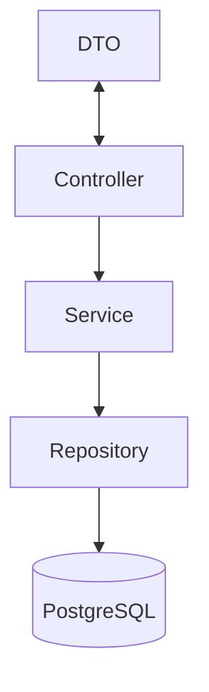

# Projeto para Cadastro de Usuários 🚀

## Descrição do projeto:
O projeto realiza coleta de dados via API e integração com o Banco de Dados através de operações CRUD.

O backend é responsável por intermediar a comunicação entre API e o banco, garantindo acesso seguro e estruturado 
aos dados.

## 🛠️ Tecnologias utilizadas
- Java 17
- Spring Boot 3
- Docker

## 🏗️ Arquitetura
O projeto segue a seguinte estrutura:
- **Entidade** - Objeto que contém os atributos a serem persistidos no banco.
- **Repositorio** - Interface de comunicação com o banco via JPA.
- **Service** - Camada de lógica de negócio.
- **DTO ( Data Transfer Object)** - Responsável pela conversão de dados entre API <-> Entidade.
- **Controller** - Exposição dos endpoints e chamada dos serviços

## 📊 Diagrama Mermaid


## ⚙️ Instalação e Configuração
Ferramentas utilizadas:
- Java 17 - Linguagem de programação
- Spring Boot - Framework backend
- Docker - Containerização

## Dependências principais
- Spring Boot Web - API REST
- Spring DevTools - Hot Reload
- Lombok - Redução de Boilerplate
- Spring Data JPA - Comunicação com o BD
- PostgreSQL Driver - JDBC para PostgreSQL
- Docker Compose - Orquestração de containers

## Comandos para levantar o projeto

```
docker compose up -d --build
```

## 🌐 Endpoints
- welcome - Mensagem de boas-vindas
- exibirTodosCadastros - Listar todos os cadastros
- cadastrarNovoUsuario - Criar um novo usuário
- atualizarCadastroDeUsuario - Atualizar dados de um cadastro já existente (PATCH)
- apagarCadastroDeUsuario - Remover um registro do banco
- alterarStatusAtivo - Alternar status ativo/inativo do usuário

## 🧪 Testes
Os testes foram realizados via Swagger UI
para acessar:
- Levante o projeto com ````docker compose up -d --build````
- Acesse: ```http://localhost:8081/swagger-ui.html```
- Utilize a interface para validar os endpoints

## 🤝 Contribuição
- Código segue principio de **Clean Code** e **Code Patterns**.
- Commits devem ser descritivos e relacionados às funcionalidades criadas.
- Pull Request são feitos via push do **IntelliJ**, com revisão na interface.
- Sugestões de melhoria podem ser enviadas via **Issues**.

## 📜 Licença
Este projeto está licenciado sob a **GPL v2.0**.
Isso garante que qualquer modificação ou redistribuição continue sendo **open source**, mantendo a mesma licença.

## 🔗 API Frontend
O frontend deste projeto está disponível em:

[Repositorio Frontend - Cadastro de Usuario](#)